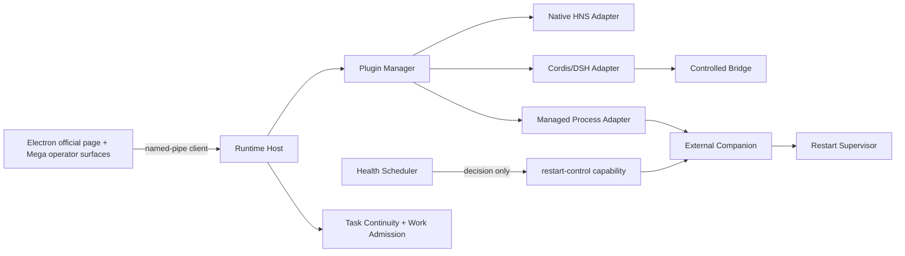
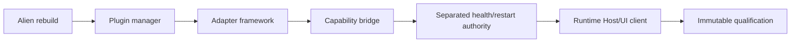
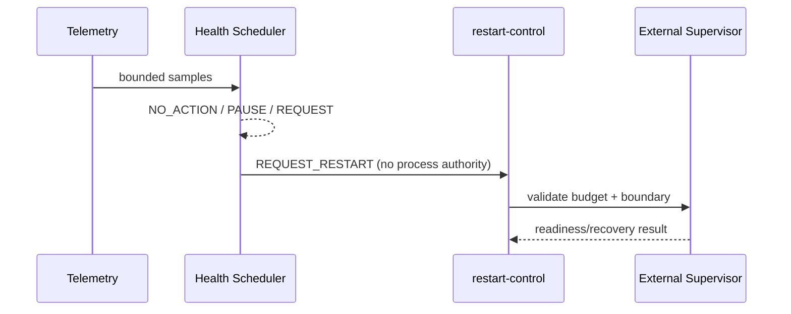
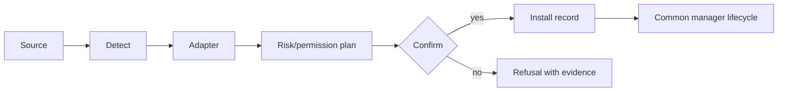
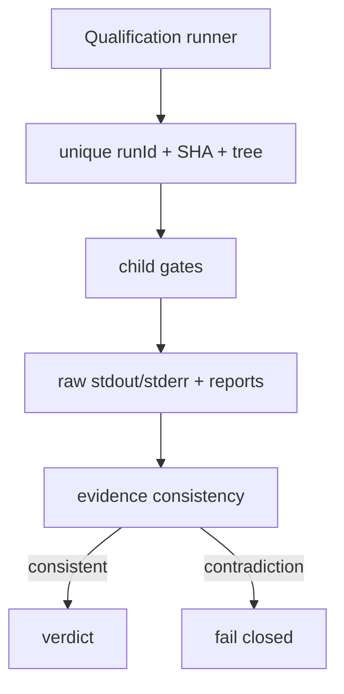
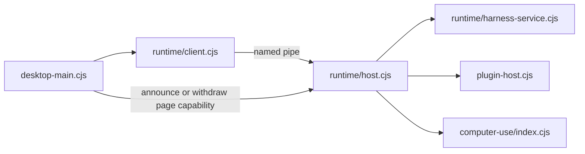
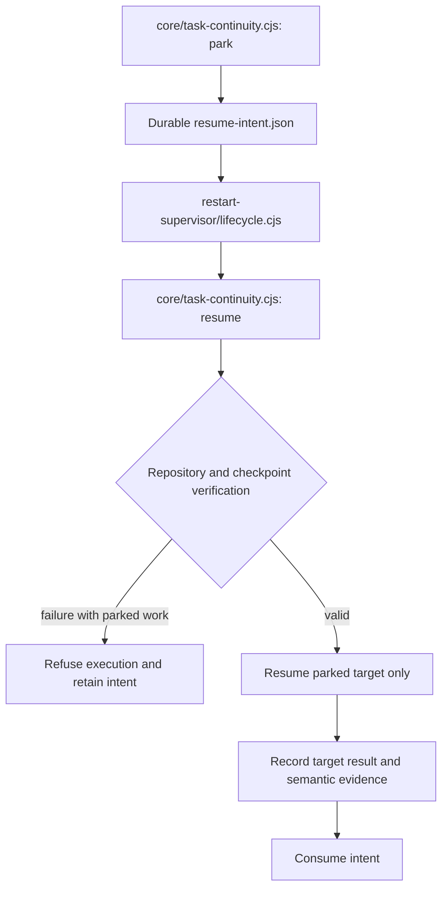

# Figure plan

## F1 — final architecture

## F2 — architecture evolution

## F3 — health/restart separation

## F4 — plugin adaptation pipeline

## F5 — qualification evidence

Performance plot data: `(baseline, optimized)` = `(17198,9141)`, `(17218,9184)`, `(17381,9248)` ms. Failure/recovery matrix rows should use the eight named chaos scenarios, not aggregate counts alone.

## F6 — runtime/UI ownership

Host services are lazy. A UI detach withdraws its capability without implying a runtime shutdown; explicit complete-stop is a separate command.

## F7 — task continuity and restart

The verification refusal was repaired in `f90660b`. This describes the implemented process-recovery path; it is not real OS-reboot evidence or a proof of exactly-once behavior under every possible crash.

## F8 — failure/recovery matrix

| Scenario ID | Injected condition | Required observed behavior | Scope |
| --- | --- | --- | --- |
| kill-core | watched application killed | companion launches a live replacement | real stand-in process |
| controlled-restart | restart-control request | continuity, boundary, stop, launch, readiness, recovery order | controlled lifecycle |
| plugin-crash | plugin fault | runtime and record survive | injected fault |
| plugin-timeout | call never answers | bounded response with honest health | injected timeout |
| network-failure | readiness network unavailable | bounded retries and optional-gate semantics | simulated network gate |
| host-restart | durable intent consumed on new start | checkpoint-aware continuation | simulated reboot path |
| git-interruption | interrupted repository stage | readable commit and no silently duplicated stage | real temporary Git repository |
| false-success | recovery claim without evidence | failure reason recorded | injected claim |

Populate measurements from the same candidate's immutable `reports/longhost-chaos.json`; each scenario has its own check count and outcome. The 65/65 focused regression after `f90660b` is separate from final full qualification.
