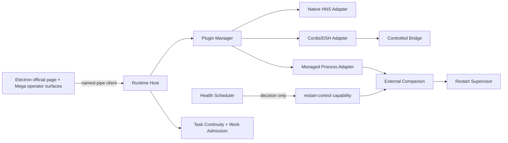
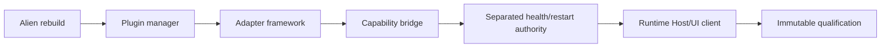
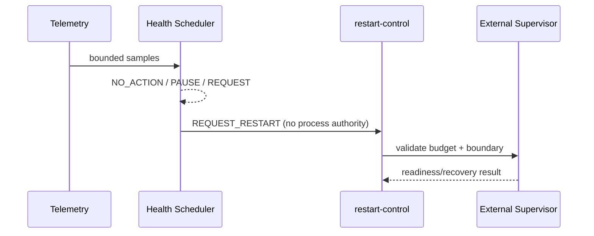
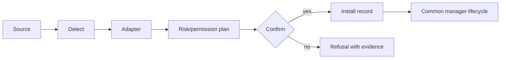
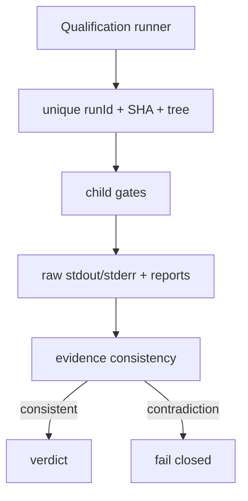

# Figure plan

## F1 — final architecture

## F2 — architecture evolution

## F3 — health/restart separation

## F4 — plugin adaptation pipeline

## F5 — task continuity and evidence

Performance plot data: `(baseline, optimized)` = `(17198,9141)`, `(17218,9184)`, `(17381,9248)` ms. Failure/recovery matrix rows should use the eight named chaos scenarios, not aggregate counts alone.
